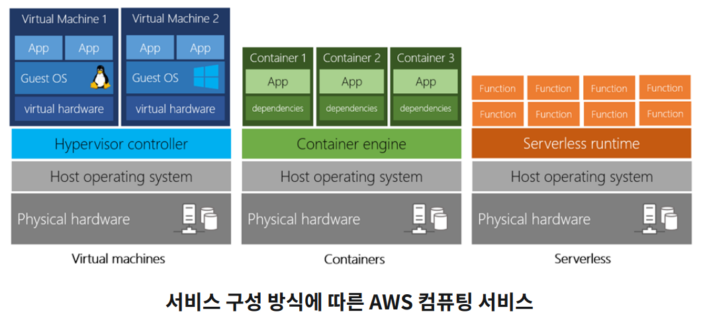
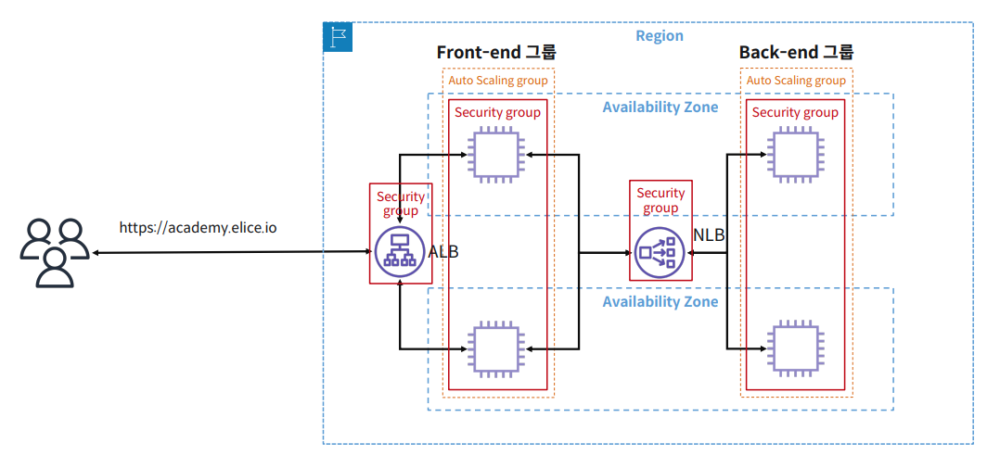

> **Elice Ai Track**에서 제공하는 강의자료를 바탕으로 작성하였습니다.

# AWS - Computing: EC2

- AWS 컴퓨팅 서비스 종류
  : Instance(가상머신), Container(컨테이너), Serverless(서버리스)



<br>

### 1. EC2 (컴퓨팅 서비스)

EC2 : Elastic Compute Cloud

- AWS의 가상머신 서비스: Instance
- 미리 정의된 템플릿, 혹은 아마존 머신 이미지(AMI)를 통해 즉시 인스턴스 생성 가능.

-> `IaaS`

< EC2 AMI >

Amazon Machine Image<br>
인스턴스 실행 시, 필요한 OS, 어플리케이션, 소프트웨어 패키지 등이 사전 구성되어 있는 템플릿이다.

<br>

### 2. EC2 보안 그룹

: AWS 서비스 수신, 발신 트랙픽을 제어하는 가상 방화벽

: 보안 그룹 정책: IP, 포트 번호, 프로토콜 등으로 제어

: 화이트 리스트 형식 (기본적으로 모든 접속을 막고 허용되어야 하는 트래픽만 허용)

**(대표적인 Port)**

```
SSH: 22 / HTTP: 80 / HTTPS: 443 / MYSQL: 1433
```

<br>

### 3. AWS 스토리지

서버에 제공 가능한 스토리지 종류

1. Direct Attached Storage (**DAS**) : 컴퓨터에 직접 연결된 스토리지
2. Network Attached Storage (**NAS**) : 외장하드와 같이 네트워크를 통해 연결된 스토리지
3. Storage Area Network (**SAN**) : 스토리지 고속 네트워크 채널을 통해 구성된 서비스

<br>

### < EBS (Elastic Block Store) >

EBS는 EC2와 연결하여 제공할 수 있는 블록 스토리지 볼륨 ‒ SAN 스토리지

<u>AZ 내에 존재</u>하는 블록 스토리지 볼륨

높은 수준의 성능이 필요할 때

상대적으로 낮은 비용으로 스토리지 구성이 필요할 때

적합한 서비스 종류 : 부팅 볼륨, NoSQL, RDBMS와 같은 **데이터베이스, 데이터 웨어 하우징 및 ETL**

<br>

### < EFS (Elastic File System) >

EBS는 EC2 와 연결하여 제공할 수 있는 파일 시스템 스토리지 볼륨 ‒ NFS 스토리지

<u>AZ 외부에 존재</u>하는 파일 시스템 스토리지 볼륨

여러 개의 인스턴스가 동시에 접속이 필요할 때

무제한으로 확장 가능한 스토리지가 필요할 때

적합한 서비스 종류 : **빅 데이터 및 분석, 미디어 처리, 워크플로, 콘텐츠 관리, 웹 서비스 및 리눅스 파일 디렉토리**

- [EC2 Mount efs](https://docs.aws.amazon.com/ko_kr/efs/latest/ug/wt1-test.html)

<br>

### 4. 고가용성 EC2 구성하기

고가용성: 시스템의 문제나 예상치 못한 트래픽이 유입 되었을 때, <u>장애에 견디고 정상적인 운영을 수행할 수 있는 구성</u>

- 수평 확장 가능한 다중 인스턴스 구조 : 고 가용성 아키텍처
  - 필요한 기능
    1. 로드 밸런서
    2. 오토 스케일링

<br>

### < 로드 밸런서 > 분배

- ELB (Elastic Load Balancer)

  ELB는 들어오는 트래픽을 컴퓨팅 서비스에 분산하는 AWS 의 관리형 로드 밸런서

- ELB 서비스의 유형으로는 ALB, NLB, CLB

1. Application Load Balancer

   - HTTP, HTTPS (애플리케이션 계층) 지원
   - L7 로드 밸런서
   - 경로 기반, 호스트 기반 라우팅
   - EC2, 컨테이너 애플리케이션 연동 지원

2. Network Load Balancer
   - TCP, UDP (네트워크 계층) 지원
   - L4 로드 밸런서
   - 낮은 지연시간이 요구되는 애플리케이션에 적합

<br>

### < 오토 스케일링 그룹 > 확장

오토 스케일링 그룹은 애플리케이션이 요구하는 컴퓨팅 자원만큼의 인스턴스의 개수를 자동으로 유지 시켜주는 그룹


