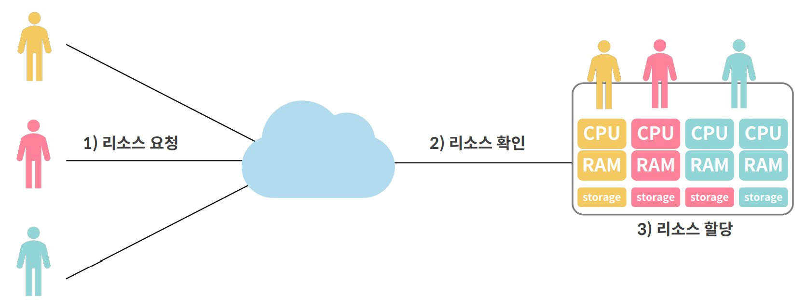
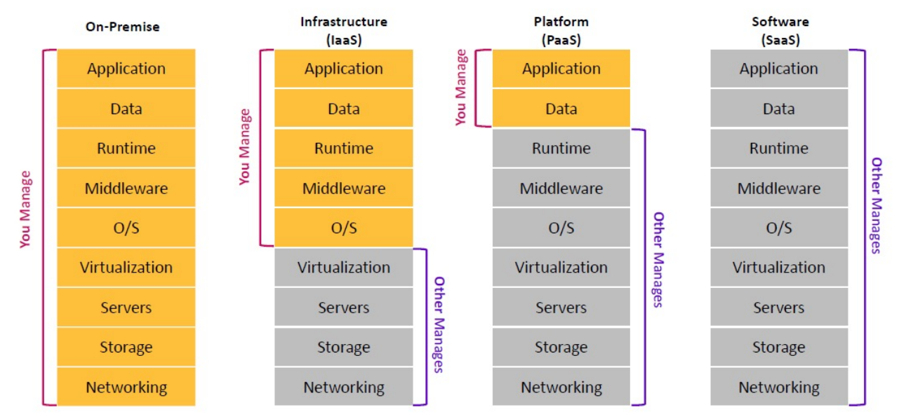

> **Elice Ai Track**에서 제공하는 강의자료를 바탕으로 작성하였습니다.

# Cloud Computing - Intro

- 주요 구성 요소

컴퓨팅 기능, 초고속 네트워크망, **가상화 기술**

- 서버 가상화 기술



출처: 엘리스

<br>

### < 클라우드 컴퓨팅 유형 >

자유도의 차이

```
클라우드 응용 SW SaaS (Software as a Service)

클라우드 플랫폼 PaaS (Platform as a Service)

클라우드 인프라 IaaS (Infrastructure as a Service)
```



출처: 엘리스

<br>

### < 클라우드 배포 유형 >

- Public/Private/Hybrid

* Private Cloud (OpenStack)<br>
  클라우드를 사용하기 원하는 기업에서 자체적으로 전용망을 이용하여 구축 하는 클라우드

* Multi Cloud <br>
  멀티 클라우드는 2곳 이상의 클라우드 벤더가 제공하는 2개 이상의 퍼블릭 또는 프라이빗 클라우드로 구성된
  클라우드 접근 방식
