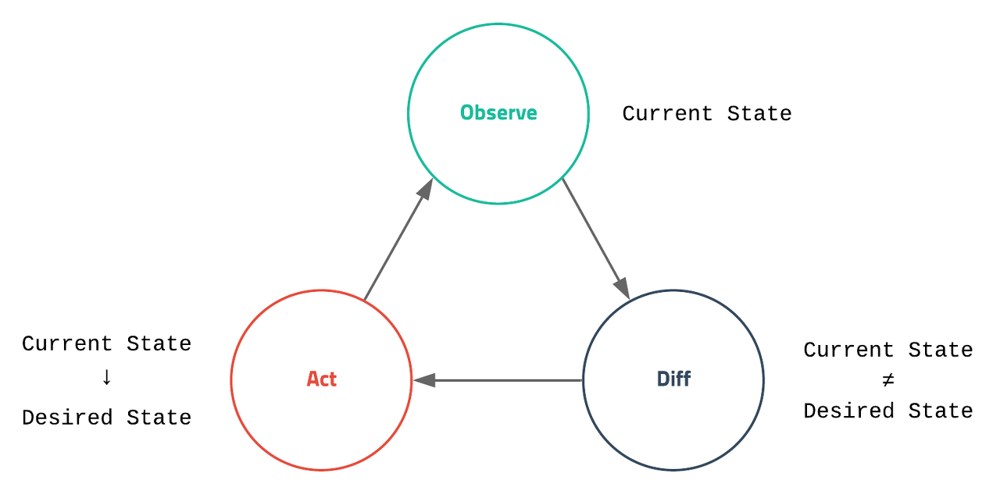
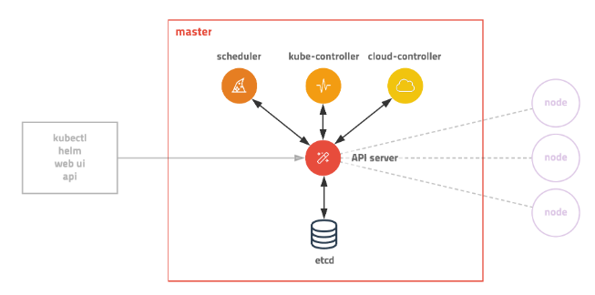
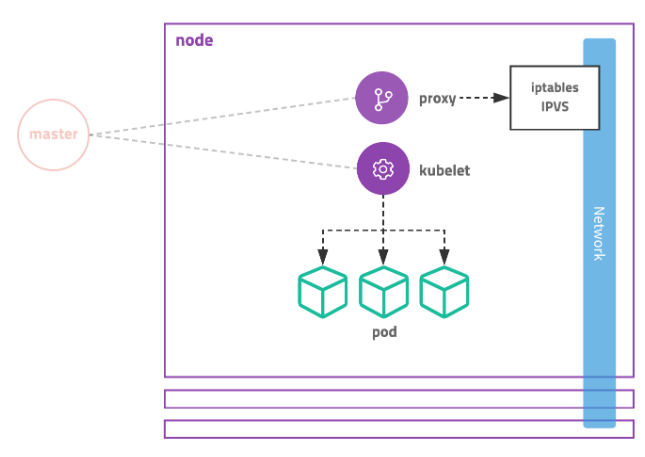

> ['초보를 위한 쿠버네티스 안내서'](https://www.youtube.com/watch?v=Ia8IfowgU7s&list=PLIUCBpK1dpsNf1m-2kiosmfn2nXfljQgb)와 ['[따배쿠] 쿠버네티스 시리즈'](https://www.youtube.com/playlist?list=PLApuRlvrZKohaBHvXAOhUD-RxD0uQ3z0c) 강의를 토대로 작성하였습니다.

> [쿠버네티스 공식 다큐먼트 사이트](https://kubernetes.io/ko/docs/tutorials/kubernetes-basics/create-cluster/cluster-interactive/)

> [추가 강의](https://www.youtube.com/watch?v=xsQsnLIyKoY&ab_channel=NETROBO%EB%84%A4%ED%8A%B8%EB%A1%9C%EB%B3%B4&loop=0)

# k8s - Intro

# 1.쿠버네티스 시작하기

## 01. 컨테이너 오케스트레이션

<br>

### [서버 관리]

- 다른 버전의 node.js 를 같은 서버에서 써야한다. 등등 한 서버에서 여러가지 버전을 잘 돌리고 싶다.

_그래서 등장!_

- VM (가상머신) : 서버 하나에 가상머신 여러개. But 여러가지 클라우드 환경에서 (multi) 사용하기 어렵고, 느리다.

_그런데!! 뚜둥 Docker 등장_

<br>

### [도커 등장]

모든 실행환경을 컨테이너로. VM 보다 효율적으로 동작한다.

<br>

### [컨테이너 특징]

```
- 가상머신과 비교하여 컨테이너 생성이 쉽고 효율적
- 컨테이너 이미지를 이용한 배포와 롤백이 간단
- 언어나 프레임워크에 상관없이 애플리케이션을 동일한 방식으로 관리
- 개발, 테스팅, 운영 환경은 물론 로컬 피시와 클라우드까지 동일한 환경을 구축
- 특정 클라우드 벤더에 종속적이지 않음
```

배포가 어려운게 local pc에서는 되는데 운영에서는 잘 안될 때가 있다. (서버 환경과 설치에 따라서 달라짐) -> 도커 사용하면 문제 생길 확률이 줄어든다.

<br>

### <u>[개발과정 정형화]</u>

Developer 코드 작성 -> Build (도커 이미지 생성) -> Ship (이미지를 도커 허브나 저장소에 저장) -> Run (도커 이미지를 컨테이너로 실행)

_그렇게 점점 컨테이너가 많아지기 시작함. 관리가 어려워짐.
그래서 컨테이너를 관리하기 위한 기술이 필요해짐._

<br>

### [컨테이너 오케스트레이션]

Container Orchestration

: <u>복잡한 컨테이너 환경을 효과적으로 관리</u>하기 위한 도구

: 컨테이너를 도커 플랫폼에 올려서 관리+운영+클러스터 서비스 지원해 주는 것

<br>

## 02. 왜 쿠버네티스인가?

컨테이너를 쉽고 빠르게 **배포/확장**하고 **관리를 자동화**해주는 오픈소스 플랫폼

1. 오픈소스
2. 무한한 확장성
3. 사실상의 표준화

: EKS, Elastic Kubernetes Service (Amazon) <br>
: AKS (Azure) <br>
: GKE, Kubernetes Engine (Google)

<br>

## 03. 어떤걸 배울가?

1. 도커 컨테이너 실행하기: 도커와 도커컴포즈를 이용한 멀티 컨테이너 관리
2. 쿠버네티스에 컨테이너 배포하기: kubectl 사용법, pod, deployment, service 등 기본 리소스 학습
3. 외부 접속 설정하기: Cluster IP, NodePort, LoadBalancer, Ingress 서비스 타입 학습, 서비스 디스커버리 학습
4. 스케일 아웃 하기: 부하에 따른 컨테이너 개수 조정, 최소 리소스 요청 설정, 오토스케일링
5. 그외 고급기능 소개: HELM 패키지 매니저 소개 등

<br>

# 2. 쿠버네티스 알아보기

**클라우드 환경**에 어울리는 배포 시스템이 **쿠버네티스**

<br>

## 02. 쿠버네티스 아키텍처

### [원하는 상태]

- Desired State



[출처](https://subicura.com/2019/05/19/kubernetes-basic-1.html)

`상태 체크 -> 차이점 발견 -> 조치`

<br>

### [구성/ 설계 Architecture]

<br>

#### 1) Master 상세



[출처](https://subicura.com/2019/05/19/kubernetes-basic-1.html)

`etcd`

```
- 모든 상태와 데이터를 저장
- 분산 시스템으로 구성하여 안전성을 높임 (고가용성)
- 가볍고 빠르면서 정확하게 설계 (일관성)
- key(directory)-Value 형태로 데이터 저장
- TTL(time to live), watch 같은 부가 기능 제공
- 백업 필수
```

<br>

`API server`

```
- 상태를 바꾸거나 조회
- etcd와 유일하게 통신하는 모듈
- REST API 형태로 제공
- 권한을 체크하여 적절한 권한이 없을 경우 요청을 차단
- 관리자 요청 뿐 아니라 다양한 내부 모듈과 통신
- 수평으로 확장되도록 디자인
```

<br>

`Scheduler`

```
- 새로 생성된 Pod을 감지하고 실행할 노드를 선택
- 노드의 현재 상태와 Pod의 요구사항을 체크
```

<br>

`Controller`

```
- 논리적으로 다양한 컨트롤러가 존재
- 끊임 없이 상태를 체크하고 원하는 상태를 유지
- 복잡성을 낮추기 위해 하나의 프로세스로 실행
```

<br>

#### 2) Node 상세



[출처](https://subicura.com/2019/05/19/kubernetes-basic-1.html)

| 컴포넌트 명 |                   역할                   |
| :---------: | :--------------------------------------: |
|     pod     |      컨테이너화된 애플리케이션 그룹      |
|   kubelet   | Node에 할당된 pod의 상태를 체크하고 관리 |
| kube-proxy  |      pod로 연결되는 네트워크를 관리      |

<br>

`kubelet`

```
- 각 노드에서 실행
- Pod을 실행/중지하고 상태를 체크
- CRI
```

<br>

`proxy`

```
- 네트워크 프록시와 부하 분산 역할
- 성능상의 이유로 별도의 프록시 프로그램 대신
```

<br>

### [Objects]

- **Pod**: 작은 작은 배포 단위
  - 고유한 IP 할당
  - 여러개의 컨테이너가 하나의 Pod에 속할 수 있다.
- ReplicaSet: 여러개의 Pod을 관리
  - replicas = 3 등 설정할 수 있다.
- Deployment: 배포 버전 관리
  - 내부적으로 ReplicaSet을 이용
- Ingress: 도메인 또는 경로별 라우팅

<br>

### [API 호출]

**YAML**

원하는 상태 (desired state)를 다양한 오브젝트 (object)로 정의(spec)하고 API 서버에 yaml 형식으로 전달
