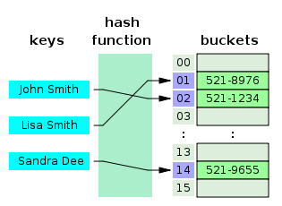

# 인덱스 (Index)

## 1. 인덱스란?

> 추가적인 쓰기 작업과 저장 공간을 활용하여 데이터베이스 테이블의 검색 속도를 향상시키기 위한 자료구조

### 1) 특징

- 인덱스는 원하는 데이터를 쉽게 찾을 수 있도록 돕는 책의 찾아보기와 유사한 개념이다.
- (장점) 조회 성능에 좋다.
- (단점) Insert, Update, Delete 등과 같은 DML 작업은 테이블과 인덱스를 함께 변경해야 하기 때문에 오히려 느려질 수 있다.

### 2) 종류

왜 인덱스를 타면 조회가 빠를까? 인덱스의 자료구조가 해시 또는 B+트리로 되어 있기 때문이다.

### 📑 해시 테이블(Hash Table)

- 시간복잡도 O(1)

해시는 등호(=) 연산에만 특화되어 있어 부등호 연산(>, <)이 자주 사용되는 데이터베이스 검색에는 해시 테이블이 적합하지 않다.

### 📎B+트리 인덱스

 
데이터의 빠른 접근을 위한 인덱스 역할만 하는 비단말 노드(not Leaf)가 분리되어 있다.
관계형 DB에서 가장 많이 사용한다.

 

## 2. 결합 인덱스

> 두 개 이상의 컬럼을 합쳐서 인덱스를 만드는 것

### ✔️ 인덱스를 선택할 때 고려할 점

### 1. 카디널리티 (Cardinality)

카디널리티가 높을 수록 인덱스 설정에 좋은 컬럼이다.
= 한 컬럼이 갖고 있는 값의 중복 정도가 낮을 수록 좋다.

### 2. 선택도 (Selectivity)

선택도가 낮을 수록 인덱스 설정에 좋은 컬럼이다.

### 3. 활용도

활용도가 높을 수록 인덱스 설정에 좋은 컬럼이다.

### 4. 중복도

중복도가 없을 수록 인덱스 설정에 좋은 컬럼이다.

 

---

## Reference & Additional Resources

-[DB 인덱스를 효과적으로 설정하는 방법 - 고려해야 할 4가지](https://yurimkoo.github.io/db/2020/03/14/db-index.html)
