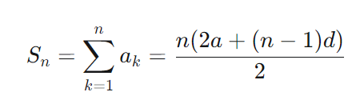

> **Elice  Ai Track**에서 제공하는 강의자료를 바탕으로 작성하였습니다.  

# 프로그래밍 수학
## 2. 수열: 수학적 귀납법

### < 등차수열 >
각 항마다 일정한 간격으로 **더해지는** 수열

$a_n =a+(n−1)d$

### < 등비수열 >
각 항 사이에 일정한 수가 **곱해지는** 수열

$a_n =a \times r^{n-1}$

### < 계차수열 >
수열 ana_na 
n
​
 이 있을때 매 항마다 더해지는 값들이 어떤 수열을 이루는 경우 더해지는 수열 bnb_nb 
n
​
 을 계차수열

 -> 일반항이라고 하기엔 $b_n$이 거추장스럽다.

 ### < 급수 >
수열의 각 항의 합

등차수열의 합<br>


등비수열의 합<br>


 ### < 점화식 >
 항들 간의 관계를 나타낸 식

 * 대표적인 수열 : **피보나치 수열**
    $$
    1\;1\;2\;3\;5\;8\;13\;21\\
    a_1 = 1\\
    a_2 = 1\\
    a_{n+2} = a_{n+1} + a_n (n\geq3)
    $$

 ### < 수학적 귀납법 >
 연쇄 반응을 이용한 등식의 증명법

 ### < 분할 정복 >
어려운 하나의 문제를 여러 개의 쉬운 문제로
```python
def div_max(a):
# a의 크기가 1개인 경우 그대로 리턴한다.
    if len(a) == 1:
        return a[0]

# a의 크기가 2개인 경우 바로 계산한다.
    if len(a) == 2:
        if a[0] > a[1]:
            return a[0]
        else:
            return a[1]

# a의 크기가 2보다 큰 경우 2개로 분할하여 푼다.
    else:
        l = len(a)
        m1 = div_max(a[0:l//2])
        m2 = div_max(a[l//2:1])
        if m1 > m2:
            return m1
        else:
            return m2
```
* 분할 정복
```python
def divSort(a):
    if len(a) <= 1:
        return a 
    elif len(a) == 2:
        if a[0] > a[1]:
            return [a[1], a[0]]
        else:
            return a
    
    else:
        l = len(a)

        m = a[l//2]
        d1 = [ i for i in a if i < m ]
        d2 = [ i for i in a if i > m ]
        
        s1 = divSort(d1)
        s2 = divSort(d2)
        return s1 + [m] + s2
```

 ### < 피보나치 수열 >
 * for문 사용하기
 ```python
 def fibo(n):
    a = 1
    b = 1
    if n == 1 or n==2:
        return 1
    for i in range(n-1):
        a, b = b, a+b 
    return a
```
* 재귀함수 사용하기
```python
def fibo(n):
    if n==1 or n==2:
        return 1
    else:
        return fibo(n-1) + fibo(n-2)
```